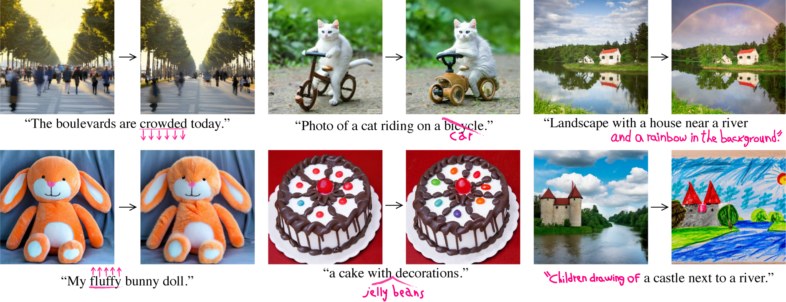
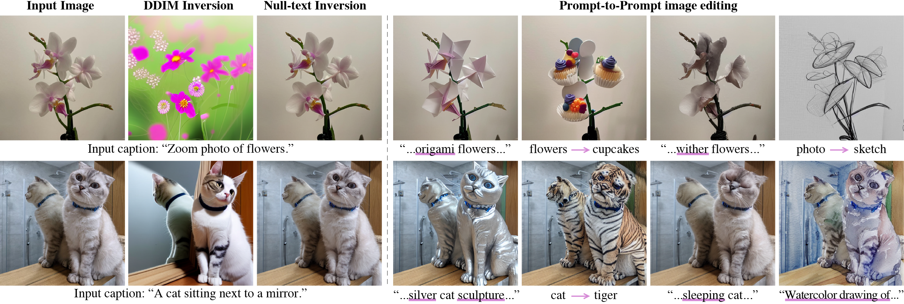

# Prompt-to-Prompt

> *Latent Diffusion* and *Stable Diffusion* Implementation



### [Project Page](https://prompt-to-prompt.github.io)&ensp;&ensp;&ensp;[Paper](https://prompt-to-prompt.github.io/ptp_files/Prompt-to-Prompt_preprint.pdf)


## Setup

This code was tested with Python 3.8, [Pytorch](https://pytorch.org/) 1.11 using pre-trained models through [huggingface / diffusers](https://github.com/huggingface/diffusers#readme).
Specifically, we implemented our method over  [Latent Diffusion](https://huggingface.co/CompVis/ldm-text2im-large-256) and  [Stable Diffusion](https://huggingface.co/CompVis/stable-diffusion-v1-4).
Additional required packages are listed in the requirements file.
The code was tested on a Tesla V100 16GB but should work on other cards with at least **12GB** VRAM.

## Quickstart

In order to get started, we recommend taking a look at our notebooks: [**prompt-to-prompt_ldm**][p2p-ldm] and [**prompt-to-prompt_stable**][p2p-stable]. The notebooks contain end-to-end examples of usage of prompt-to-prompt on top of *Latent Diffusion* and *Stable Diffusion* respectively. Take a look at these notebooks to learn how to use the different types of prompt edits and understand the API.

## Prompt Edits

In our notebooks, we perform our main logic by implementing the abstract class `AttentionControl` object, of the following form:

``` python
class AttentionControl(abc.ABC):
    @abc.abstractmethod
    def forward (self, attn, is_cross: bool, place_in_unet: str):
        raise NotImplementedError
```

The `forward` method is called in each attention layer of the diffusion model during the image generation, and we use it to modify the weights of the attention. Our method (See Section 3 of our [paper](https://arxiv.org/abs/2208.01626)) edits images with the procedure above, and  each different prompt edit type modifies the weights of the attention in a different manner.

The general flow of our code is as follows, with variations based on the attention control type:

``` python
prompts = ["A painting of a squirrel eating a burger", ...]
controller = AttentionControl(prompts, ...)
run_and_display(prompts, controller, ...)
```

### Replacement
In this case, the user swaps tokens of the original prompt with others, e.g., the editing the prompt `"A painting of a squirrel eating a burger"` to `"A painting of a squirrel eating a lasagna"` or `"A painting of a lion eating a burger"`. For this we define the class `AttentionReplace`.

### Refinement
In this case, the user adds new tokens to the prompt, e.g., editing the prompt `"A painting of a squirrel eating a burger"` to `"A watercolor painting of a squirrel eating a burger"`. For this we define the class `AttentionEditRefine`.

### Re-weight
In this case, the user changes the weight of certain tokens in the prompt, e.g., for the prompt `"A photo of a poppy field at night"`, strengthen or weaken the extent to which the word `night` affects the resulting image. For this we define the class `AttentionReweight`.


## Attention Control Options
 * `cross_replace_steps`: specifies the fraction of steps to edit the cross attention maps. Can also be set to a dictionary `[str:float]` which specifies fractions for different words in the prompt.
 * `self_replace_steps`: specifies the fraction of steps to replace the self attention maps.
 * `local_blend` (optional):  `LocalBlend` object which is used to make local edits. `LocalBlend` is initialized with the words from each prompt that correspond with the region in the image we want to edit.
 * `equalizer`: used for attention Re-weighting only. A vector of coefficients to multiply each cross-attention weight

## Citation

``` bibtex
@article{hertz2022prompt,
  title = {Prompt-to-Prompt Image Editing with Cross Attention Control},
  author = {Hertz, Amir and Mokady, Ron and Tenenbaum, Jay and Aberman, Kfir and Pritch, Yael and Cohen-Or, Daniel},
  journal = {arXiv preprint arXiv:2208.01626},
  year = {2022},
}
```

# Null-Text Inversion for Editing Real Images

### [Project Page](https://null-text-inversion.github.io/)&ensp;&ensp;&ensp;[Paper](https://arxiv.org/abs/2211.09794)


Null-text inversion enables intuitive text-based editing of **real images** with the Stable Diffusion model. We use an initial DDIM inversion as an anchor for our optimization which only tunes the null-text embedding used in classifier-free guidance.




## Editing Real Images

Prompt-to-Prompt editing of real images by first using Null-text inversion is provided in this [**Notebooke**][null_text].


``` bibtex
@article{mokady2022null,
  title={Null-text Inversion for Editing Real Images using Guided Diffusion Models},
  author={Mokady, Ron and Hertz, Amir and Aberman, Kfir and Pritch, Yael and Cohen-Or, Daniel},
  journal={arXiv preprint arXiv:2211.09794},
  year={2022}
}
```


## Disclaimer

This is not an officially supported Google product.

[p2p-ldm]: prompt-to-prompt_ldm.ipynb
[p2p-stable]: prompt-to-prompt_stable.ipynb
[null_text]: null_text_w_ptp.ipynb
